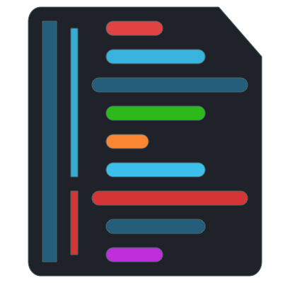
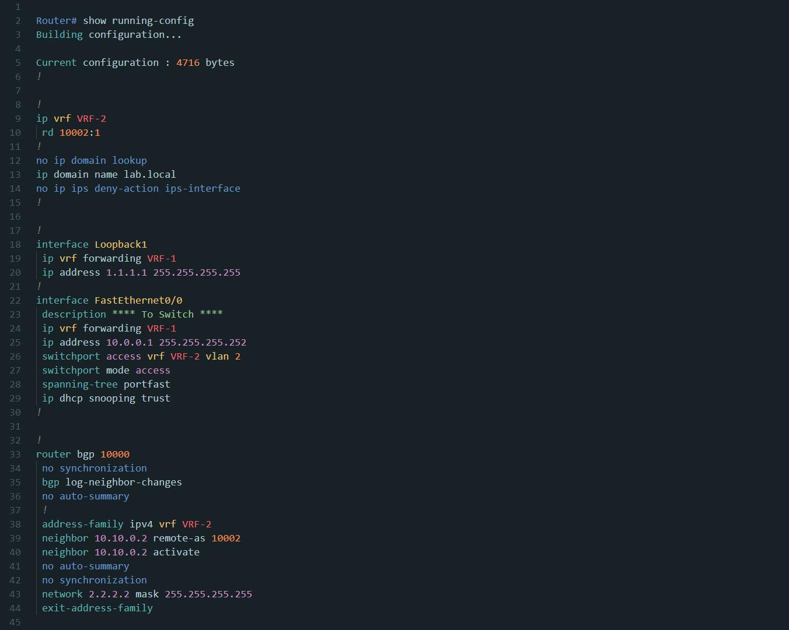
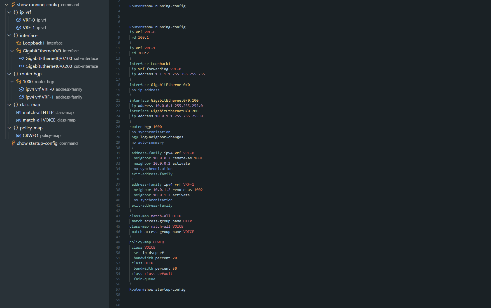

<h1 align="center">
  <a href="https://github.com/Y-Ysss/vscode-cisco-config-highlight">
    
  </a><br>
    Cisco Config Highlight
</h1>
<p align="center">Visual Studio Code用のCiscoデバイス設定ファイルのシンタックスハイライト拡張機能です。</p>

**English version: [README.md](README.md)**

このプロジェクトは開発中です。

将来のバージョンで定義が変更される可能性があります。

> [!NOTE]  
> 実験的なツールをリリース  
> トークンの定義のカスタマイズを行うためのツールを公開しました。  
> テーマエディタで、トークンのスコープを確認しながら、色やスタイルのカスタマイズができます。  
> このツールは実験的な機能で、今後変更される可能性があります。  
> - [TextMate Theme Editor for Cisco Config Highlight](https://text-mate-theme-editor.yuyosy.workers.dev)
>
> テーマエディタはブラウザで動作するWebアプリケーションです。
> 
> 


## 機能
この拡張機能は、Cisco設定ファイルに対して以下の機能を提供します:

- シンタックスハイライト
- 設定のアウトライン表示（実験的機能）
- 設定ファイルの診断（実験的機能）


## インストール
VS Code用の拡張機能は、Visual Studio MarketplaceおよびOpen VSX Registryで入手できます:
- [Visual Studio Marketplace - Cisco Config Highlight](https://marketplace.visualstudio.com/items?itemName=Y-Ysss.cisco-config-highlight)
- [Open VSX Registry - Cisco Config Highlight](https://open-vsx.org/extension/Y-Ysss/cisco-config-highlight)


## サポートプラットフォーム

設定ファイルで一般的に使用される構文をサポートしています。
- IOS
- IOS-XE
- NXOS

以下のプラットフォームについても、IOSと共通する構文に対してシンタックスハイライトを提供します:
- IOS-XR
- ASA

将来的にこれらのプラットフォームのサポートを拡大していく予定です。


## スクリーンショット
> [!NOTE]  
> このREADME内のすべてのスクリーンショットは、カスタムテーマ（[Y-Ysss/Daybreak Theme](https://marketplace.visualstudio.com/items?itemName=Y-Ysss.vscode-daybreak-theme)）を使用しています。



## トークンカラーのカスタマイズ

シンタックスハイライトの色は、有効にしているテーマに依存します。

VSCodeのデフォルトテーマでは、すべてのハイライト設定が有効化されていません。より良い体験のために、カスタムテーマの使用を推奨します。

また、現在有効なテーマで色が定義されていない場合、または色やスタイルを好みに合わせてカスタマイズしたい場合は、`settings.json`を編集する必要があります。

設定を開き、カスタマイズオプションをJSONに追加してください。
（コマンドパレットで`Preferences: Open Settings (JSON)`と入力すると`settings.json`ファイルを開くことができます。）

settings.jsonファイルのカスタマイズ方法の詳細については、以下のURLを参照してください。

[Visual Studio Code ドキュメント - カラーテーマ](https://code.visualstudio.com/docs/getstarted/themes)

### スコープの階層構造
トークンは階層構造に従っており、カスタマイズ時にスコープを省略することができます。

例として以下の2つのスコープを指定した場合:
- `entity.name.class.interface.ethernet`
- `entity.name.class.interface.loopback`

上記の完全なスコープを指定すると、カスタマイズは指定のトークンにのみ適用されます。

また、以下のような上位レベルのスコープを使用すると:
- `entity.name.class.interface`

カスタマイズはそのスコープ配下のすべてのトークンに適用されます。
階層が上位（浅い）ほど、影響を受けるトークンの範囲が広くなります。


### VSCode settings.json カスタマイズサンプル
``` json
    "editor.tokenColorCustomizations": {
        "textMateRules": [
            {
                "scope": "entity.name.class.interface.ethernet",
                "settings": {
                    "foreground": "#328f16",
                    "fontStyle": "italic"
                }
            },
            {
                "scope": [
                    "keyword.other.address",
                    "constant.numeric"
                ],
                "settings": {
                    "foreground": "#cc0ca2",
                    "fontStyle": "underline"
                }
            }
        ]
    }
```

## トークンスコープ一覧
```
comment.block.banner
comment.line.config

constant.numeric.hex
constant.numeric.integer

entity.name.class.interface.async
entity.name.class.interface.bri
entity.name.class.interface.bvi
entity.name.class.interface.cellular
entity.name.class.interface.dialer
entity.name.class.interface.ethernet
entity.name.class.interface.loopback
entity.name.class.interface.management
entity.name.class.interface.null
entity.name.class.interface.portchannel
entity.name.class.interface.serial
entity.name.class.interface.tunnel
entity.name.class.interface.virtual-template
entity.name.class.interface.vlan
entity.name.class.interface.wireless
entity.name.class.interface.bdi
entity.name.class.interface.nvi
entity.name.class.interface.vmi
entity.name.class.interface.vasileft
entity.name.class.interface.vasiright
entity.name.class.interface.app-gigabitethernet

entity.name.class.vrf.declaration

entity.name.tag.acl.access-group.name
entity.name.tag.acl.access-list.name
entity.name.tag.acl.access-class.name

entity.name.tag.bgp.neighbor-peer-group.name
entity.name.tag.bgp.peer-group.name
entity.name.tag.bgp.peer-policy.name
entity.name.tag.bgp.peer-session.name

entity.name.tag.config-string.domain-name
entity.name.tag.config-string.hostname
entity.name.tag.config-string.logging-system-message
entity.name.tag.config-string.username
entity.name.tag.config-string.name
entity.name.tag.config-string.role

entity.name.tag.wireless.ssid.name

entity.name.tag.crypto.crypto-map.name
entity.name.tag.crypto.transform-set.name
entity.name.tag.crypto.ipsec-profile.name
entity.name.tag.crypto.isakmp-profile.name
entity.name.tag.crypto.keyring.name
entity.name.tag.crypto.key-chain.name

entity.name.tag.group.class-map.name
entity.name.tag.group.class.name
entity.name.tag.group.object-group.name
entity.name.tag.group.policy-map.name
entity.name.tag.group.pool.name
entity.name.tag.group.prefix-list.name
entity.name.tag.group.route-map.name
entity.name.tag.group.service-policy.name
entity.name.tag.group.policy-list.name
entity.name.tag.group.traffic-filter.name
entity.name.tag.group.community.name

entity.name.tag.event-manager.applet.name
entity.name.tag.event-manager.environment.name
entity.name.tag.event-manager.run.name
entity.name.tag.event-manager.action.label

entity.name.tag.vrf.vrf-name

keyword.other.acl.access-list.type
keyword.other.address.ipv4.cidr
keyword.other.address.ipv4.full
keyword.other.address.ipv6.condensed
keyword.other.address.ipv6.full
keyword.other.address.mac

keyword.other.config-keyword.add-remove.add
keyword.other.config-keyword.add-remove.except
keyword.other.config-keyword.add-remove.remove
keyword.other.config-keyword.allowed-native
keyword.other.config-keyword.any-all.all
keyword.other.config-keyword.any-all.any
keyword.other.config-keyword.in-out.in
keyword.other.config-keyword.in-out.out
keyword.other.config-keyword.input-output.input
keyword.other.config-keyword.input-output.output
keyword.other.config-keyword.inside-outside.inside
keyword.other.config-keyword.inside-outside.outside
keyword.other.config-keyword.match.all
keyword.other.config-keyword.match.any
keyword.other.config-keyword.permit-deny.deny
keyword.other.config-keyword.permit-deny.permit
keyword.other.config-keyword.shutdown
keyword.other.config-keyword.status.administratively-down
keyword.other.config-keyword.status.deleted
keyword.other.config-keyword.status.down
keyword.other.config-keyword.status.up
keyword.other.config-keyword.switchport-mode.access
keyword.other.config-keyword.switchport-mode.dynamic
keyword.other.config-keyword.switchport-mode.trunk
keyword.other.config-keyword.enable-disable.enable
keyword.other.config-keyword.enable-disable.disable
keyword.other.config-keyword.vlan
keyword.other.group.object-group.type

meta.function-call.command_hostname.privileged-mode
meta.function-call.command_hostname.user-mode
meta.function-call.command-disable.default
meta.function-call.command-disable.unused

punctuation.config-param.first

string.other.description
string.other.password
string.other.remark
string.other.secret
string.other.key-string
```

## 実験的機能

以下の実験的機能が利用可能です。この拡張機能の設定で有効化できます。

> [!NOTE]  
> 以下の実験的機能はまだ開発中であり、今後のバージョンで変更される可能性があります。

- アウトラインパネルでのシンボル表示
- Diagnostics (診断機能)


### アウトラインパネルでのシンボル表示



設定を開き、検索ボックスにキーワードを入力してください。チェックボックスを選択することで有効化できます。

```
@ext:Y-Ysss.cisco-config-highlight showSymbolsInOutlinePanel
```

#### サポートされているシンボル
- コマンド
  - `hostname#{command name}`
  - `hostname>{command name}`
- 仮想ルーティング・フォワーディング(VRF)
  - `ip vrf {vrf-name}`
- ボーダーゲートウェイプロトコル(BGP)
  - `router bgp {autonomous-system-number}`
  - `address-family ipv4 {unicast|multicast|vrf vrf-name }`
- グループ
  - `class-map {match-any|match-all} name`
  - `policy-map {name}`
- インターフェイス
  - `interface {type, slot, port, etc...}`
  - 例: `interface GigabitEthernet0/0`
- サブインターフェイス
  - `interface {type, slot, port, etc...}.{number}`
- ルートマップ
  - `route-map {name} {permit|deny} {sequence-number}`
- IPv4プレフィックスリスト
  - `ip prefix-list {name} ...`

#### アウトラインの階層構造と大きなファイル

`hostname#show running-config`や`hostname>show ...`などのプロンプトコマンドは、コマンドシンボルとして認識されます。`show`コマンドに続く出力は、該当する場合、そのコマンドの配下にグループ化されます。設定シンボルはカテゴリノードにまとめられ、サブインターフェイスは親インターフェイスの配下に、BGPアドレスファミリは対応するBGPプロセスの配下にネストされます。

UTF-8バイト数が`cisco-config-highlight.outline.maxFileSizeForFullScan`を超えるファイルでは、アウトラインはファイルの先頭部分のみを走査します。切り詰めシンボルは、残りの内容が走査されていないことを示します。

### Diagnostics (診断機能)

診断は以下の範囲をチェックします:

- IPv4のルート、インターフェイスアドレス、プレフィックスリスト
- IPv6のアドレス、プレフィックスリスト、ACLプレフィックス
- IPv4 ACLのワイルドカードマスク
- IOSおよびNX-OSのネットワークオブジェクトグループ

**エラー**は、IPv4/IPv6アドレスまたはマスク／ワイルドカードの値が不正であることを示します。**警告**には、プレフィックス長の形式不正または範囲外、不正なプレフィックスリスト修飾子や修飾子間の関係、許可されていない非連続サブネットマスクが含まれます。

対応済みコマンドの完全な`no ...`形式にも同じ診断を適用します。`no ip address`や`no <sequence>`のようにオペランドを省略する削除形式は認識しますが、診断は生成しません。

診断は、すべてのコマンドやプラットフォーム固有構文を検証するものではありません。大容量文書は設定予定Configではなく実機からの取得ログである可能性が高いため、UTF-8バイト数が`cisco-config-highlight.diagnostics.maxFileSize`を超える文書は診断しません。既定の上限は1 MiBで、Settingsから変更できます。スキップ時に通知は表示しません。


## 注意事項
### 大きなファイルでのハイライト

大きなファイルでハイライトを有効にしたい場合は、以下の設定をfalseに変更してください:
```
"editor.largeFileOptimizations": false
```
ただし、VSCodeはパフォーマンス上の理由から、大きなファイルではハイライト機能を無効化しており、強制的にシンタックスハイライトを有効にすると、エディタのパフォーマンスが低下する可能性があります。


### 設定画面でサポートされている言語
設定画面で以下の言語がサポートされています:

- 英語
- 日本語


## 推奨拡張機能
より良い視覚的な体験のために、以下の拡張機能を推奨します:
- [Y-Ysss/Daybreak Theme](https://marketplace.visualstudio.com/items?itemName=Y-Ysss.vscode-daybreak-theme)
- [Jarvis Prestidge/Sublime Material Theme](https://marketplace.visualstudio.com/items?itemName=jprestidge.theme-material-theme)

## リクエストまたは問題報告
リクエストや問題がある場合は、GitHubでIssueを開くか、プルリクエストを送信してください。

[GitHub - Y-Ysss/vscode-cisco-config-highlight](https://github.com/Y-Ysss/vscode-cisco-config-highlight)

## ライセンス
MIT License Copyright (c) 2021 Y-Ysss
