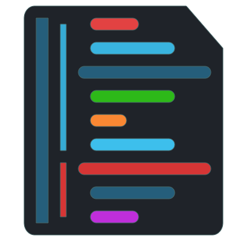
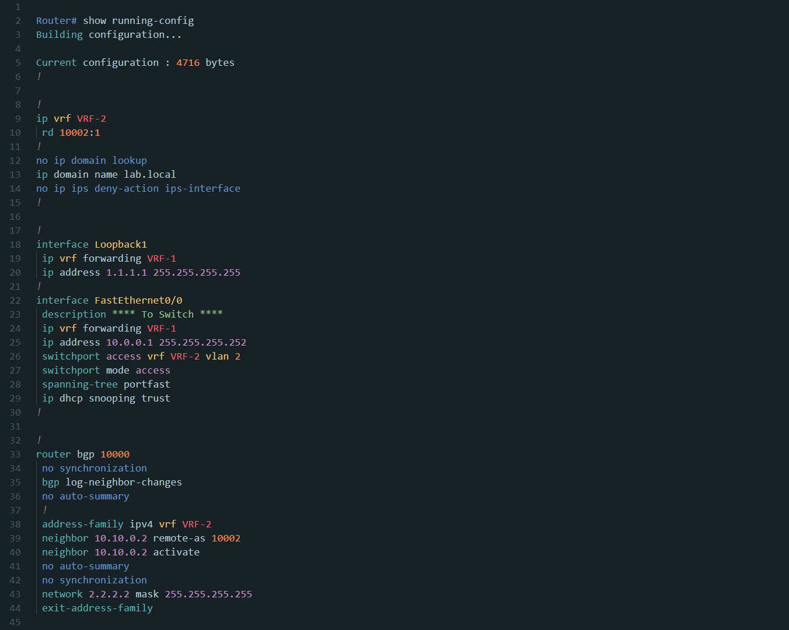
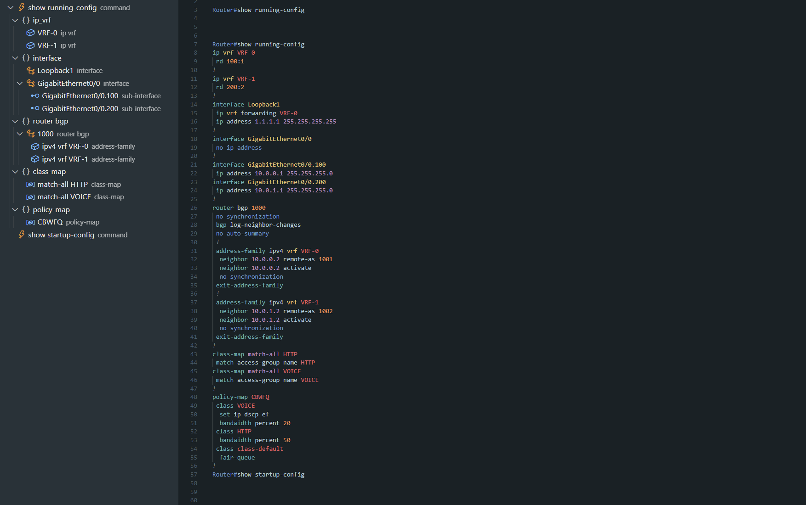

<h1 align="center">
  <a href="https://github.com/Y-Ysss/vscode-cisco-config-highlight">
    
  </a><br>
    Cisco Config Highlight
</h1>
<p align="center">Cisco device configuration Syntax Highlighting for Visual Studio Code.</p>

This project is in the development stages.

There's a possibility that definitions will change in the future.

## Features
This extension provides some awesome features for Cisco config text, including:

- Syntax highlighting
- Config outline (Experimental)

## Supported Platforms

Syntaxes often used in Config are supported.
- IOS

The following platforms provide similar highlighting for syntaxes that overlap with IOS.

In the future, I would like to support the following platforms.
- NXOS
- IOS-XR
- IOS-XE
- ASA


## Screenshot
Note: Screenshots are using a custom theme ([Y-Ysss/Daybreak Theme](https://marketplace.visualstudio.com/items?itemName=Y-Ysss.vscode-daybreak-theme)).


## Token Color Customizations

The color of syntax highlighting depends on the theme you have enabled.

All highlighting settings are not enabled in VSCode's default theme. For a better experience, I recommend using a custom theme.

If the colors are not defined in the currently activated theme, or if you want to customize the colors and style to your liking, you will need to edit the `settings.json`.

Open the settings and add option strings to JSON.
(You can open the `settings.json` file by typing `Preferences: Open Settings (JSON)` in the command palette.)

For more information on how to customize the settings.json file, please refer to the following URL.

[Visual Studio Code Documentaion - Color Themes](https://code.visualstudio.com/docs/getstarted/themes)

### VSCode settings.json customize sample
``` json
    "editor.tokenColorCustomizations": {
        "textMateRules": [
            {
                "scope": "entity.name.class.interface.ethernet",
                "settings": {
                    "foreground": "#328f16",
                    "fontStyle": "italic"
                }
            },
            {
                "scope": [
                    "keyword.other.address",
                    "constant.numeric"
                ],
                "settings": {
                    "foreground": "#cc0ca2",
                    "fontStyle": "underline"
                }
            }
        ]
    }
```

## Token Scopes List
```
comment.block.banner
comment.line.config

constant.numeric.hex
constant.numeric.integer

entity.name.class.interface.async
entity.name.class.interface.bri
entity.name.class.interface.bvi
entity.name.class.interface.cellular
entity.name.class.interface.dialer
entity.name.class.interface.ethernet
entity.name.class.interface.loopback
entity.name.class.interface.management
entity.name.class.interface.null
entity.name.class.interface.portchannel
entity.name.class.interface.serial
entity.name.class.interface.tunnel
entity.name.class.interface.virtual-template
entity.name.class.interface.vlan
entity.name.class.interface.wireless
entity.name.class.vrf.declaration

entity.name.tag.acl.access-group.name
entity.name.tag.acl.access-list.name

entity.name.tag.bgp.neighbor-peer-group.name
entity.name.tag.bgp.peer-group.name
entity.name.tag.bgp.peer-policy.name
entity.name.tag.bgp.peer-session.name

entity.name.tag.config-string.domain-name
entity.name.tag.config-string.hostname
entity.name.tag.config-string.logging-system-message
entity.name.tag.config-string.username

entity.name.tag.crypto.crypto-map.name
entity.name.tag.crypto.transform-set.name

entity.name.tag.group.class-map.name
entity.name.tag.group.class.name
entity.name.tag.group.object-group.name
entity.name.tag.group.policy-map.name
entity.name.tag.group.pool.name
entity.name.tag.group.prefix-list.name
entity.name.tag.group.route-map.name
entity.name.tag.group.service-policy.name

entity.name.tag.vrf.vrf-name
entity.other.vrf.definition
entity.other.vrf.forwarding

keyword.other.acl.access-list.type
keyword.other.address.ipv4.cidr
keyword.other.address.ipv4.full
keyword.other.address.ipv6.condensed
keyword.other.address.ipv6.full
keyword.other.address.mac

keyword.other.config-keyword.add-remove.add
keyword.other.config-keyword.add-remove.except
keyword.other.config-keyword.add-remove.remove
keyword.other.config-keyword.allowed-native
keyword.other.config-keyword.any-all.all
keyword.other.config-keyword.any-all.any
keyword.other.config-keyword.in-out.in
keyword.other.config-keyword.in-out.out
keyword.other.config-keyword.input-output.input
keyword.other.config-keyword.input-output.output
keyword.other.config-keyword.inside-outside.inside
keyword.other.config-keyword.inside-outside.outside
keyword.other.config-keyword.match.all
keyword.other.config-keyword.match.any
keyword.other.config-keyword.permit-deny.deny
keyword.other.config-keyword.permit-deny.permit
keyword.other.config-keyword.shutdown
keyword.other.config-keyword.status.administratively-down
keyword.other.config-keyword.status.deleted
keyword.other.config-keyword.status.down
keyword.other.config-keyword.status.up
keyword.other.config-keyword.switchport-mode.access
keyword.other.config-keyword.switchport-mode.dynamic
keyword.other.config-keyword.switchport-mode.trunk
keyword.other.config-keyword.vlan
keyword.other.group.object-group.type

meta.function-call.command_hostname.privileged-mode
meta.function-call.command_hostname.user-mode
meta.function-call.command-disable.default
meta.function-call.command-disable.unused

punctuation.config-param.first

string.other.description
string.other.password
string.other.remark
string.other.secret
```

## Experimental Features

- Show symbols in outline panel
- Multilingual support (settings page)


### Show symbols in outline panel



Open the settings and enter a keyword in the search box. Select the check box to enable.

```
@ext:Y-Ysss.cisco-config-highlight showSymbolsInOutlinePanel
```

#### Supported symbols
- Command
  - `hostname#{command name}`
  - `hostname>{command name}`
- Virtual Routing and Forwarding(VRF)
  - `ip vrf {vrf-name}`
- Border Gateway Protocol(BGP)
  - `router bgp {autonomous-system-number}`
  - `address-family ipv4 {unicast|multicast|vrf vrf-name }`
- Group
  - `class-map {match-any|match-all} name`
  - `policy-map {name}`
- Interface
  - `interface {type, slot, port, etc...}`
  - e.g. `interface GigabitEthernet0/0`
- Sub Interface
  - `interface {type, slot, port, etc...}.{number}`

### Multilingual support
Currently, only the settings page is available.

Following supported languages:
- English
- Japanese

## Notes
### Highlighting in large files

If you want to enable highlighting in large files. Change the following settings to False.
```
"editor.largeFileOptimizations": false
```
However VSCode disable feature on large files for performance reasons, and forcing VSCode to syntax highlight large files may result in poor editor performance.

## Installation

[Visual Studio Marketplace - Cisco Config Highlight](https://marketplace.visualstudio.com/items?itemName=Y-Ysss.cisco-config-highlight)

## Recommended Extensions
I recommend the following extensions to more beautiful look.
- [Y-Ysss/Daybreak Theme](https://marketplace.visualstudio.com/items?itemName=Y-Ysss.vscode-daybreak-theme)
- [Jarvis Prestidge/Sublime Material Theme](https://marketplace.visualstudio.com/items?itemName=jprestidge.theme-material-theme)

## Requests or Issues
If you have any requests or issues, please start an Issue or PullRequest on GitHub.

[GitHub - Y-Ysss/vscode-cisco-config-highlight](https://github.com/Y-Ysss/vscode-cisco-config-highlight)

## License
MIT License Copyright (c) 2021 Y-Ysss